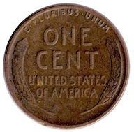
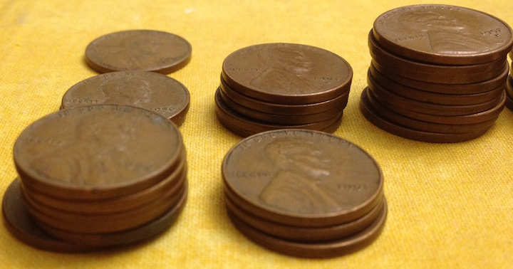

# Example: A Penny Collection

```{r include = FALSE}
require(DataComputing)
show_answers <- FALSE
```

The same data can be represented in different ways. One or another way may be easiest, depending on the sort of calculation you are performing.

A friend, when cleaning out a closet in 2016, came across a small, glass bottle with coins in it.  The coins were US 1-cent pieces, called "pennies". All of the coins were from before 1959. As with current pennies, the pennies had a picture of Lincoln on one side --- the "obverse". On the reverse side, the old-style pennies have a "wheat" design:

```{r echo = FALSE, fig.cap = 'The "wheat" design on pennies before 1959.', fig.align = "center"}

```

The friend was interested to know if these coins were rare. First step in finding out, make a catalog of what he had. She noticed that some of the coins were stamped with an "S" and some with a "D," but many had no stamp at all. So she sorted out the coins by year and stamp, and counted.

```{r echo = FALSE, fig.cap = 'Pennies in the collection from years 1950, 1951, and 1952. The front row has no stamp, the middle row has stamp "D", and the back row has stamp "S".', fig.align = "center", out.width = "50%"}

```

## Three formats for the penny data table

**Format 1**

After counting the pennies in each stack, she compiled the data table available at `"http://tiny.cc/dcf/my_pennies_format_1.csv"`.


```{r cache = TRUE}
Format_1 <- readr::read_csv("http://tiny.cc/dcf/my_pennies_format_1.csv")
head(Format_1, 10)
```

Questions:

1. What is the case in the `Format_1` data table?
2. How would you wrangle the table to produce a count of all the pennies, together?
```{r echo = show_answers, results="hide"}
Format_1 %>%
  summarise(total = 
              sum(none, na.rm = TRUE) +
              sum(D, na.rm = TRUE) + 
              sum(S, na.rm = TRUE)
              )
```
3. How would you calculate the mean age of the pennies? (Hint: not so easy. Multiply the year by the penny counts, add up, and divide by the total number of pennies.)
```{r echo = show_answers, results="hide"}
Format_1 %>% 
  summarise(total = 
              sum(none, na.rm = TRUE) +
              sum(D, na.rm = TRUE) + 
              sum(S, na.rm = TRUE),
            product = 
              sum(year * none, na.rm = TRUE) +
              sum(year * D,    na.rm = TRUE) +
              sum(year * S,    na.rm = TRUE)
              ) %>%
  summarise(mean_age = product / total)
```

**Format 2**

Seeing that these calculations are hard to read and understand, the collector decided to reformat the data to look like this:

year | count | stamp
-----|-------|------
1958 | 4     | none
1958 | 6     | D
1957 | 11    | none
1957 | 9     | D
$\vdots$ | $\vdots$ | $\vdots$

```{r echo = FALSE}
Format_2 <-
  Format_1 %>%
  gather(key = stamp, value = count, -year) %>%
  arrange(desc(year)) %>% 
  na.omit()
```

```{r echo = FALSE, eval = FALSE}
# just for one time
write.csv(Format_2, file = "Data/my_pennies_format_2.csv", row.names = FALSE)
```

The complete data set in this format is available at `"http://tiny.cc/dcf/my_pennies_format_2.csv"`.

```{r echo = FALSE, results='hide'}
Format_2 <- readr::read_csv("Data/my_pennies_format_2.csv")
head(Format_2, 10)
```
1. What is the case in the `Format_1` data table?
```{block echo = show_answers}
A year-stamp combination.
```

2. How would you wrangle the table to produce a count of all the pennies, together?
```{r echo = show_answers, result = "hide"}
Format_2 %>%
  summarise(total = sum(count, na.rm = TRUE))
```
3. How would you calculate the mean age of the pennies? (Hint: This is much easier than for `Format_1`.)
```{r echo = show_answers, result = "hide"}
Format_2 %>% 
  summarise(mean_age = 
              sum(year * count, na.rm = TRUE) / 
              sum(count, na.rm = TRUE))
```
4. How do you wrangle the `Format_1` data table into the form of `Format_2`.
```{r echo = show_answers}
Format_2 <-
  Format_1 %>%
  gather(key = stamp, value = count, -year) %>%
  arrange(desc(year)) %>% 
  na.omit()
```
5. The two formats differ: one is in narrow form, the other in wide form. Which is which?
```{block echo = show_answers}
`Format_1` is in wide format, `Format_2` is narrow. In the narrow format, one of the variables (`stamp`) serves as a key. The different values of that key are broken into separate variables in the wide format.
```

Question:

1. Suppose that some additional pennies were added to the collection with new stamps, say "W" and "Z". Which of the formats, wide or narrow, would be better suited so that your wrangling statements to find the number of coins and the mean age would continue to work?
```{block echo = show_answers}
The statements for `Format_2` would continue to work. For the `Format_1` wrangling statements, you would have to add new components for each of the different values of `stamp`.
```

1. Counts, wide: year, Phila., Denver, SF
    - What's the case?
2. Counts, narrow: year, origin, count
    - Converting between (1) and (2)
3. Pennies, narrow: year, origin
4. Pennies, wide
    - Converting between (3) and (4)
    - Producing (1) and (2) from (4)

**Format 3**

Another friend suggested that it might be better to store the data with one row for each penny, like this:

```{r echo = FALSE}
Format_3 <- 
  Format_2[rep(1:nrow(Format_2), Format_2$count), 1:2]
```

```{r echo=FALSE, eval = FALSE}
# Just to create the data file
write.csv(Format_3, file="Data/my_pennies_format_3.csv", row.names = FALSE)
```

```{r echo = FALSE}
head(Format_3, 12)
```

The complete data set in this format is available at `"http://tiny.cc/dcf/my_pennies_format_3.csv"`.

Questions

1. How can you tell the case in `Format_3` is a single penny?
```{block echo = show_answers}
You might infer this from the absence of a `count` variable. But it's really to codebook you would need to look at to figure out the case unit.
```
2. How would you count the number of pennies in the collection?
```{r echo = show_answers}
Format_3 %>%
  tally()   # or, equivalently summarise(total = n())
```
3. How would you find the mean year for the coins in the collection?
```{r echo = show_answers}
Format_3 %>%
  summarise(mean_year = mean(year, na.rm = TRUE))
```

## More tasks

Use at least one of the formats to do the following. Even better if you try to do it with more than one format, but this might be hard

1. Identify the years for which D and S stamps together outnumber P stamps.
2. Calculate the mean year for each stamp.


## Extending the data

* Suppose you want a "condition" for each coin?
* Suppose you want to include coins other than pennies?
* Suppose you want to have prices that depend on year, origin, denomination, condition?
